<h1 align="center">
   Ownvoice
</h1>

<p align="center">
  <a href="https://github.com/umeranjum17/ownvoice/actions/workflows/android.yml"></a>
  <a href="LICENSE"></a>
  
</p>

<p align="center">
  <strong>Polish your words. Written on your phone.</strong><br/>
  Ownvoice is a small bubble that sits over your chats. Tap it to polish what you already typed, or tidy any text you select. Reply ideas are unavailable for now. It writes on the phone itself, or with the ChatGPT plan you already pay for. It tells you plainly how each draft reads, and you always press Send yourself.
</p>

<h3 align="center"><a href="#get-started"><ins>Get started</ins></a></h3>

<p align="center">
  <a href="#download--install">Download</a> ·
  <a href="#see-it-in-action">See it in action</a> ·
  <a href="#your-words-stay-yours">Privacy</a> ·
  <a href="#build-it-yourself">Build it yourself</a> ·
  <a href="mobile/README.md">Developer notes</a>
</p>

<p align="center">
  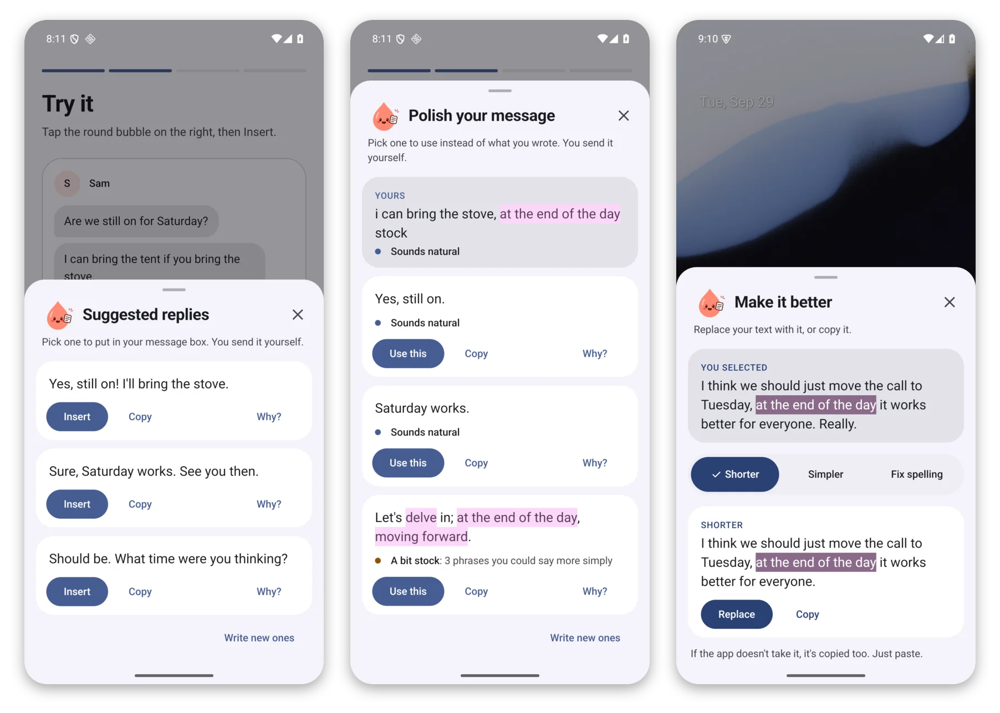
</p>

## Why Ownvoice exists

Writing help usually means pasting your message into a chat window, getting back something that sounds like everyone else, and pasting it back. The words stop being yours.

Ownvoice lives where you already write. It reads the screen only when you tap its bubble, writes a few short options that sound like a person, and marks the phrases that sound canned. Nothing gets sent for you. You pick, you edit, you press Send.

## See it in action

### Reply ideas, one tap away

**Known limit in 1.0.3:** generic reply cards are withheld. Ownvoice cannot reliably check whether a new reply invents facts about you or someone else from the screen alone. An empty message box where there is something to reply to shows **Reply ideas are unavailable for now. Write your reply first, then tap the bubble to polish it.** A blank composer with nothing to answer asks for the one line instead (see [Start a post from a blank composer](#start-a-post-from-a-blank-composer)). No reply is generated, streamed, retried or offered to copy or insert, with either writer. Your voice notes describe style, not facts. No extra checker is used. The reply screenshots below show earlier behavior, not this release. Still open for 1.0.3: names in polished drafts keep their own check, which this release did not rerun, and the withheld path was only walked with no writer chosen, so the ChatGPT and phone writer routes are unrehearsed here.

<p align="center">
  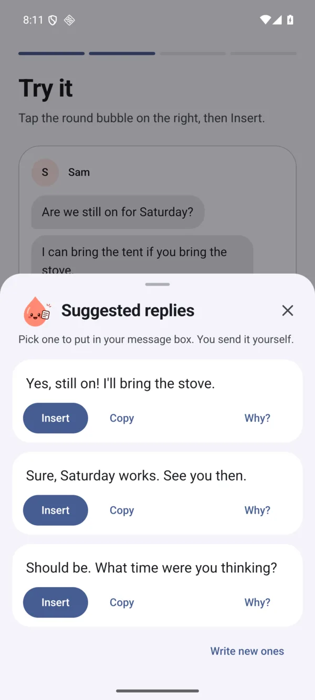
</p>

### Polish what you wrote

On X and Reddit, the panel names the platform beside its heading. A new post you typed shows **Polish your post · X** or **Polish your post · Reddit**. A reply you started under a post shows **Suggested replies · X** (or **· Reddit**): your text stays as **Yours**, and the suggestions build on your point, best fit first. This works in their Android apps and in Chrome when its address bar identifies the site. Replies and versions use that platform’s writing rules and length checks. Other apps keep their existing headings. While Ownvoice reads the screen, the heading says **Writing…**.

Already typed something? The same tap shows your text with the stock phrases marked, then a few better versions of it. **Use this** swaps your text for one of them. **Cleaned up** fixes clear spelling slips, clear missing apostrophes such as “dont”, accidental repeats of “the”, “a” or “an” starting with a lowercase copy, and “Its” before “a”, “an” or “the”. For example, “Its a good plan, I shoud be there by the the evening.” becomes “It's a good plan, I should be there by the evening.” This card uses only your own text and those clear fixes; the writer supplies the other versions. Other suspected slips appear under **Check these** when spelling checks are on; each has its own **Fix**. When no different version is found, Ownvoice keeps your text and asks you to read it over before sending. That does not approve the writing.

<p align="center">
  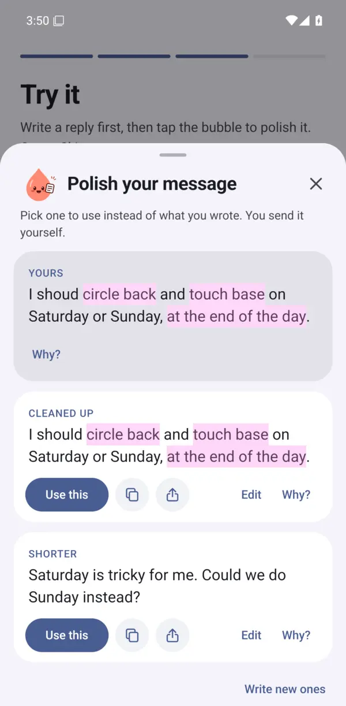
</p>

### Start a post from a blank composer

On X, LinkedIn, Reddit and the other feed apps, tapping the bubble in an **empty** composer shows **Start your post** and asks for one line: write what the post is about, then tap the bubble again.

Nothing in an empty composer says what you want to write, so Ownvoice does not guess a topic and does not hand you a question to post in your place. Write one line — a note, a result, a thing you changed — and it drafts the post from that line in your own voice and your writing rules. From there it is the same panel as anywhere else: **Edit** changes the text, the checks follow your edit, and **Use this** puts exactly your text in the composer. You write the post and press Post yourself. Chat and mail composers are unaffected: they keep the empty state and the withheld reply above.

### Honest about every draft

A draft shows no verdict until all the deeper checks have run. Even then, Ownvoice leaves approval blank because the wording has not been fully checked; it does not call a draft “Sounds natural”. Concerns can still appear, such as “Check the wording” or “A bit stock: 3 phrases you could say more simply”. When every suggested draft has the same verdict, the repeated sentence is left off.

**Why?** on your original text or a suggested draft lists stock phrases, whether it says something real, whether it fits the chat and whether it makes anything up separately, each with a reason or a note that the check has not run. Possible slips get their own warning; otherwise a separate wording row says the wording has not been fully checked. Ticks mark passing checks, warnings mark concerns, and a dash marks an unchecked item. Each draft also names its tone in a word or two, such as “Sounds friendly”. There is no score to chase.

### Make any text better

Select text in any app, choose **Ownvoice** from the selection menu (or share the text to Ownvoice), and pick **Shorter**, **Simpler**, **Fix spelling**, **Friendlier** or **Firmer**. **Copy** copies the version, then paste it where you like, or **Share this text** to choose where it goes. If a new version adds a time, a number or a fact you didn't write, it says **Check this**, and **Copy** and **Share this text** stay disabled while it shows. This works without the bubble's permission.

<p align="center">
  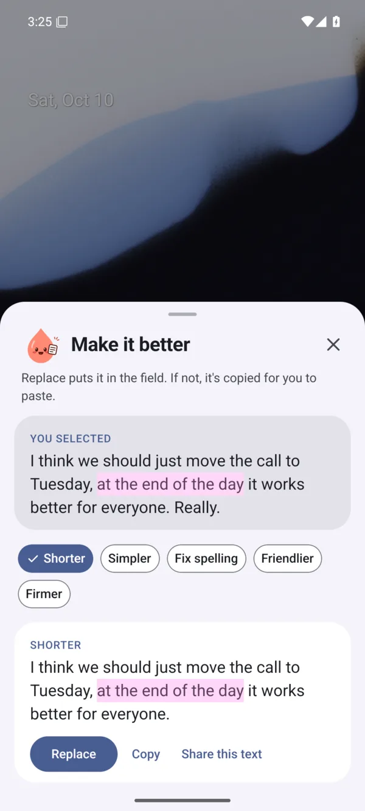
</p>

### Your choice of writer

Pick who writes your drafts, and change it any time. **On this phone** is private and free: nothing you read or write leaves the phone, and it works without internet. Phones that need it get a one-time download of about 2 to 3 GB, on Wi-Fi, and only after you say yes. **With your ChatGPT** and **With your Claude** use the plan you already pay for: sharper and usually quicker, but what's on screen goes to that service when you tap the bubble.

<p align="center">
  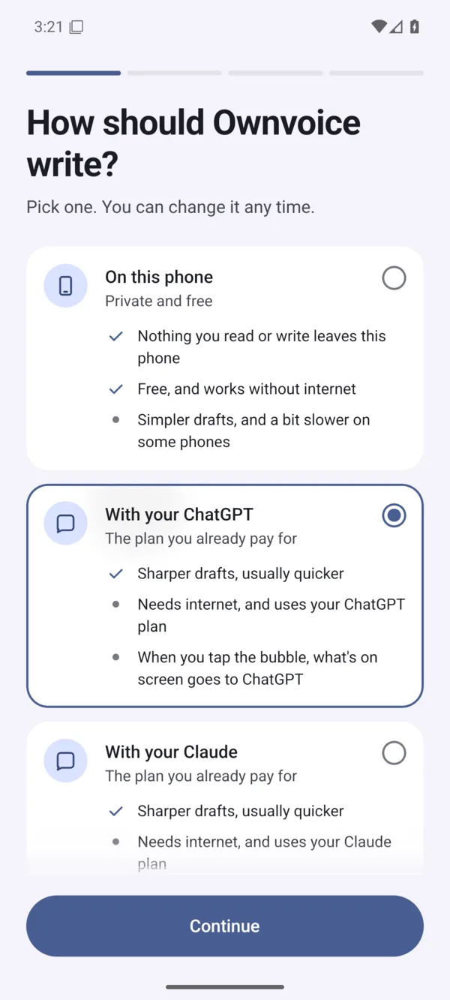
</p>

### Your growth

About a day after you insert a suggestion, Home asks how your reply did: **Got replies back**, **Some likes**, **Nothing yet**, or **Didn't post it**. The answer stays on that reply's record on your phone. Spelling fixes and **Yours** do not get this check-in. There is no automatic count read; use the answer buttons.

Home also shows a plain-words reminder when you have no saved counts or a week has passed since your last save. Tap **See your growth** to enter your X follower count and Reddit karma on **Your growth**. Use whole numbers without commas or spaces; karma can be negative. You can leave either count blank. Your counts appear only on this screen, with a line since you started. Each platform compares its own last two entries: **Up since last week** (or Same / Down) only when they are about a week apart in this week and last week; otherwise it says **since you last checked**. It never claims Ownvoice caused a change. Answers and counts save locally, work offline, and call no writer. If a save fails, your answer or count inputs stay available to try again.

### Everything in one place

Home shows at a glance whether Ownvoice is ready, and holds every setting: how Ownvoice writes, which apps show the bubble, your voice, and what Ownvoice read.

<p align="center">
  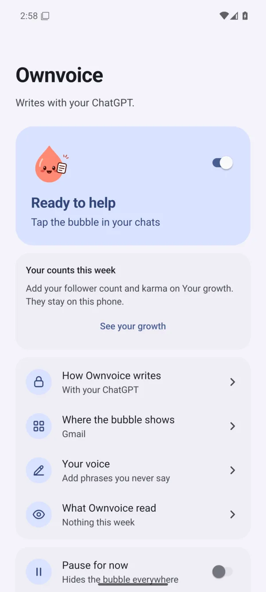
</p>

**Also on your phone:**

- **Your voice**: the phrases you never say, a short note on how you write, and two rules (no long dashes; end posts on a statement). Questions remain allowed in replies, including on X and Reddit. Drafts follow them, and any phrase on your list is marked wherever it shows up. Long dashes are removed unless your text uses one and the no-dashes rule is off; dashes inside links, email addresses, handles and tags stay intact. You can also import a list from a file.
- **Where the bubble shows**: the bubble appears only in the apps you switch on. X, LinkedIn, Reddit, Slack, WhatsApp (and WhatsApp Business) and Gmail start on; everything else starts off.
- **Pause for now**: hides the bubble everywhere until you turn it back on.
- **Your phone's look**: Ownvoice uses your phone's colours and font, and follows light and dark mode.

<p align="center">
  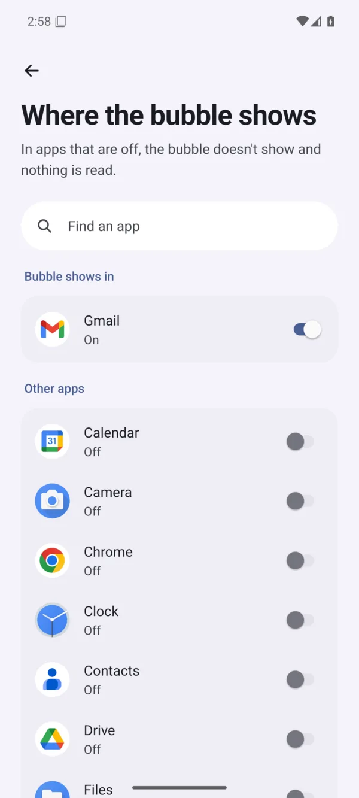
  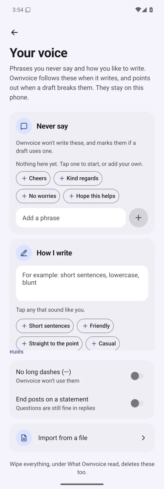
</p>

## Your words stay yours

Ownvoice reads the screen only when you tap its bubble, never in the background, and only in apps you switched on. It never taps Send, posts or acts for you. The one exception is a switch you have to turn on yourself, described below.

- **On this phone**, nothing you read or write leaves the phone. Ownvoice has no server of its own.
- **With your ChatGPT** or **With your Claude**, the chat on screen, what you typed and your writing rules go to that service, only when you tap the bubble. Text you select and send to **Make it better** goes there too. Ownvoice keeps no copy.
- **Check my spelling as I type** is off unless you switch it on in Home. When it's on, Ownvoice also reads the message box you're typing in each time you stop typing for a moment, in apps you switched on, and a number on the bubble shows how many things look worth checking: spelling, common slips like "its" for "it's", and stock phrases. The check runs on the phone, even when you chose ChatGPT: nothing you type goes anywhere, nothing is kept, and these checks don't show up in What Ownvoice read. Tap the bubble to see them; each has its own **Fix**, and nothing changes until you tap it.
- **What Ownvoice read** lists every tap: the app, the time and what it helped with, never your text. It stays on the phone, each entry is deleted after 30 days, and **Wipe everything** clears it at once, along with Your voice, saved reply records (including check-in answers), the reply-text saving choice, and your growth counts.

<p align="center">
  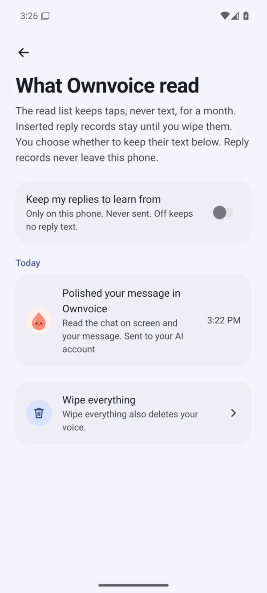
</p>

The exact data flows, including the one-time download and the remote on/off switch for ChatGPT, are written down in [mobile/README.md](mobile/README.md#how-ownvoice-writes).

## Download / Install

[**Download Ownvoice for Android**](https://github.com/umeranjum17/ownvoice/releases/latest/download/Ownvoice.apk)

Open this link on your phone, tap **Download**, then **Open** and **Install**; if asked, allow your browser to install it, come back, and tap **Install**. Tap **Open** to see Welcome. The app appears as **Ownvoice** on your home screen. Requires Android 8 or later.

If **Use Ownvoice** is greyed out during setup, open Ownvoice's **App info**, tap **⋮** at the top, choose **Allow restricted settings**, then return to Ownvoice and tap **Turn on**.

<p align="center">
  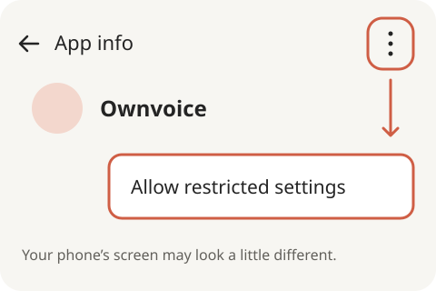
</p>

[All releases](https://github.com/umeranjum17/ownvoice/releases)

## Get started

Then setup takes about a minute:

1. **Open Ownvoice** and tap **Continue**.
2. **Choose how Ownvoice writes.**
   - **On this phone**: pick it and tap **Continue**. If the phone first needs its one-time download, the button reads **Get it ready** (about 2 to 3 GB, once, on Wi-Fi).
   - **With your ChatGPT**: pick it and tap **Continue**, then **Copy code and open ChatGPT**, and type the code on the ChatGPT page. Come back to Ownvoice and tap **Continue**.
   - **With your Claude** (added from Home's **How Ownvoice writes**, not first-run setup): pick it, tap **Open the Claude page**, sign in there with the account you already have, then copy the code that page shows and paste it into Ownvoice.

   If your phone can't write on its own, Ownvoice says so and the button reads **Continue with ChatGPT**.
3. **Let Ownvoice see your chats, only when you tap.** Tap **Turn on**. In the phone's settings, in **Downloaded apps** tap **Ownvoice**, switch on **Use Ownvoice**, and tap **Allow**. Ownvoice comes back by itself. If the switch is greyed out, tap **Switch greyed out?** in Ownvoice: on Android 13 and later, apps installed from a file need **Allow restricted settings** in App info first.
4. **Try it.** A practice chat opens with the bubble at the right edge. Write your own reply first, then tap the bubble to polish it and choose **Use this**, or tap **Skip**. Empty-field reply ideas are unavailable.
5. **Where should I help?** Switch on the apps you want and tap **Done**. (If none of X, LinkedIn, Reddit, Slack, WhatsApp or Gmail is on the phone, this step is skipped.)

<p align="center">
  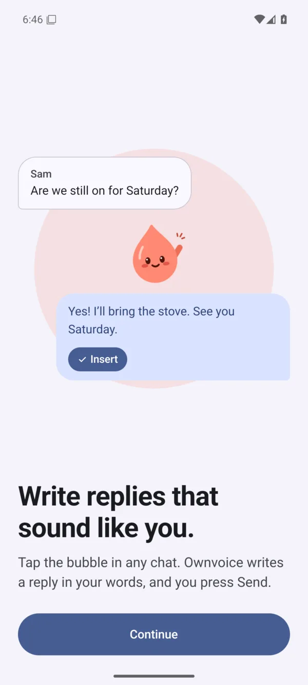
  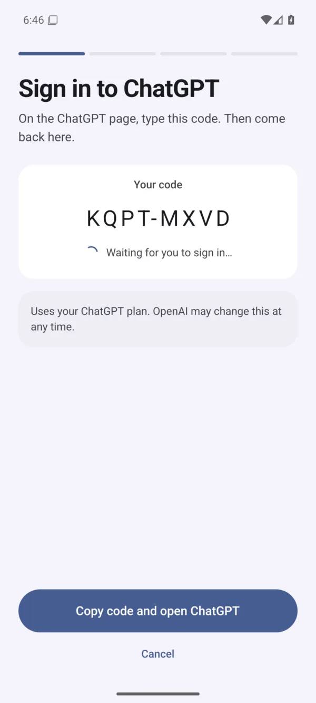
  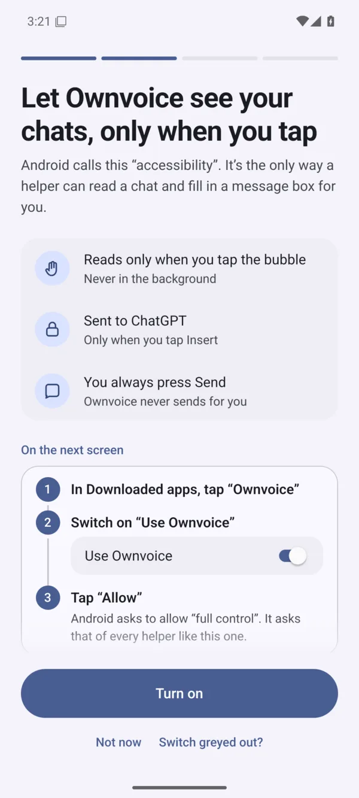
  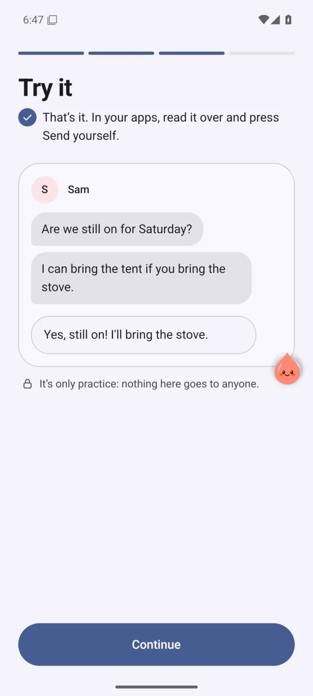
</p>

From then on: open a chat in one of your apps, write your reply in the message box, and tap the bubble. Read any version over before choosing **Use this**, and press Send yourself.

## Build it yourself

You need [Node.js 22](https://nodejs.org/), JDK 17, the Android SDK, and `adb` with your phone connected and USB debugging on.

```sh
git clone https://github.com/umeranjum17/ownvoice
cd ownvoice/mobile
npm ci
npx expo prebuild --platform android --no-install
cd android
./gradlew assembleRelease --no-daemon
adb install app/build/outputs/apk/release/app-release.apk
```

This installs the Expo app shown above (`dev.ownvoice.next`) alongside the original Kotlin app (`dev.ownvoice.app`). If you already installed the downloaded APK, see [Signed APK releases](mobile/README.md#signed-apk-releases) before installing a local build.

## Development

This repository holds two Android apps plus the shared writing core:

- **[`mobile/`](mobile/README.md)**: the Expo app shown in this README. Its README covers the checks, emulator tests, build flags and how Ownvoice writes. The writer's quality gate is in [`mobile/eval/`](mobile/eval/README.md).
- **[`app/`](app/README.md)**: the original Kotlin app (`dev.ownvoice.app`), which the Expo app succeeds but does not yet fully replace. Its README covers how drafts are scored, its privacy details, and its build and device tests.
- **[`packages/engine/`](packages/engine/README.md)**: the model-free writing core. Its README covers package usage, protocol, checks and releases. The app imports it; `mobile/src/core/` also holds app-specific adapters and local checks. For the mobile voice wrapper's compatibility behavior and deferred integration, see [Reply samples](packages/engine/README.md#reply-samples-020--protocol-2).

For both apps' shared artwork, regeneration commands and icon previews, see the
[Android icon guide](docs/icons/README.md).

Checks for the Expo app:

```sh
cd mobile
npm ci
npm run lint
npm run typecheck
npm test -- --ci
```

For shared engine checks, see [Development and release](packages/engine/README.md#development-and-release).

Build and unit-test the Kotlin app from the repository root:

```sh
./gradlew :app:assembleDebug :app:testDebugUnitTest
```

Agents working here should read [AGENTS.md](AGENTS.md) first: it records the device quirks that cost the most time.

## License

Apache-2.0. See [LICENSE](LICENSE).
