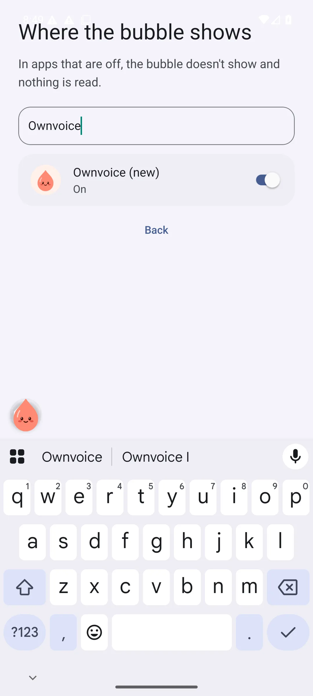
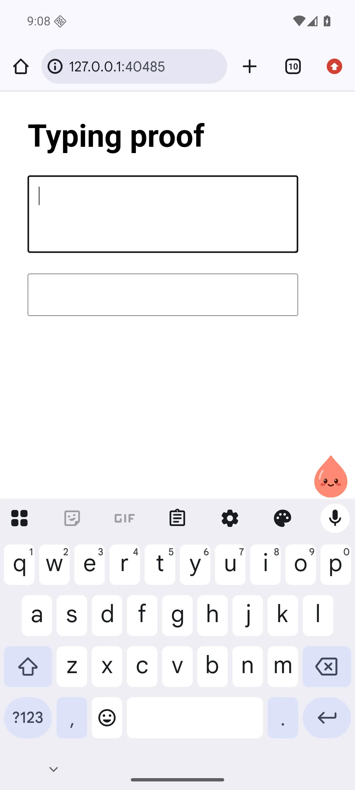

# OV-7: shared overlay migration and emulator proof

Ownvoice pins npm `@byokit/overlay` exactly at 0.2.2. Its accessibility service drives the kit's Kotlin `ServiceBubble`, accessibility host, foreground app, keyboard inset and focused-field APIs. The kit owns gestures, placement, per-app spots and insertion retries/re-acquisition. The `FieldNode.of` identity is captured at tap time; insertion uses 13 attempts at 150 ms and accepts `landedWithoutNewlines`. No private insert or placement workaround remains.

Ownvoice keeps its screen heuristics, tap-fact schema, moods, models and panel. One JSON source supplies the seven default apps to JavaScript and both Android apps. Only the used text-change event is subscribed; opt-in typing still waits 700 ms and reads the focused non-password field through the kit. Sign-in, phone-only promises and app words are unchanged.

Old per-app spots (`ownvoice-native` / `bubble:<package>`) are decoded once and passed to public kit `Placement.snap` and `SpotStore`. Existing kit spots win; malformed old values keep the kit default. The kit owns subsequent persistence.

## Approved geometry

Firstmate resolved `overlay022-placement` on 2026-09-30: use the shared kit geometry, provided the bubble stays above the keyboard and clear of the focused field. No private geometry implementation was added.

| Behaviour | Before | Kit 0.2.2 |
| --- | --- | --- |
| Bubble size | 52 dp | 56 dp |
| Edge inset | 8 dp | 0 |
| Keyboard gap | 8 dp | 0 |
| Drag threshold | 12 dp on either axis | 8 dp Euclidean |

Before (existing RN-14 keyboard proof) and after (OV-7 focused textarea proof), showing the approved size/edge/gap differences:

The measured after bounds are bubble `[933,1370,1080,1517]`, keyboard `[0,1517,1080,2400]`, focused field `[84,532,908,771]`. The bubble is wholly above the keyboard and does not intersect the field. [Raw geometry](ov7-overlay/geometry.json).

## Validation

- Final-main Expo prebuild and release assembly passed (752 tasks); module and kit JVM tests passed, including captured input, copy-only, placement equivalents and legacy-spot migration.
- Legacy app debug assembly and JVM tests passed.
- Lint/typecheck passed with throwaway HOME; 47 Jest suites, 767 tests and 46 snapshots passed.
- Flag-cache regression passed: clean/normal-after-flags both 4 markers; removing the cache fix yielded 6. The lab screen stayed out of normal exports.
- First-run light/dark passed on the rebuilt APK: ChatGPT stand-in selected/connected, plain text, practice insertion landed.
- Insertion driver passed RN and Chrome textarea/contenteditable multiline read-back, pause/resume, per-app off/on and service rebind after reinstall. Contenteditable returned the kit's newline-loss success; textarea retained line breaks.
- Overlay proof passed keyboard/field clearance, TalkBack label `Ownvoice`, keyboard-close spot restoration, tap-only typing while off, opt-in count `Ownvoice, one thing to check`, password exclusion, kill -9 + am start restore, and emulator reboot restore without service toggles.
- rn08 passed light-mode copy-only selection/share handback, clipboard fingerprints and new-number warning. Dark-mode selection stopped at `Ownvoice selection action missing`: its OCR-only menu selector missed the real accessible `Ownvoice (new)` action at `[381,1121,738,1247]`. The editable field still contains `Move Tuesday. Really.`. Full dark handback and the later R5/panel-verdict scenarios remain unverified; the harness time box has elapsed.

The standalone probe instruments itself with `FLAG_DONT_SUPPRESS_ACCESSIBILITY_SERVICES`, leaving Ownvoice's process/service attached. It reads actual switch checked state, labels and editable values, and omits password text. Harness navigation uses Expo route links; rewrite chips use physical taps on accessible bounds. Copy handback compares the editable field exactly, avoiding a false failure from the shortened Copy toast. OCR is used where accessible targeting is unavailable.

Logs/screenshots are under `/home/umer/lab-tmp/ov-eng-7`: `release-final-main.log`, `jest-rebased.log`, `flag-cache-final.log`, `first-run-rebased.log`, `driver-routes-final.log`, `overlay-proof-final.log`, and `rn08-verified.log`, `rn08-dark-menu-state.txt`, and `rn08-dark-menu.png`. Lane AVD is `ov-eng-7` / `emulator-5582`; it was stopped after the time-boxed validation round. Nothing pushed; no no-mistakes run started.
