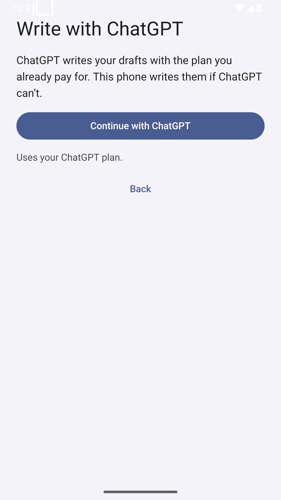
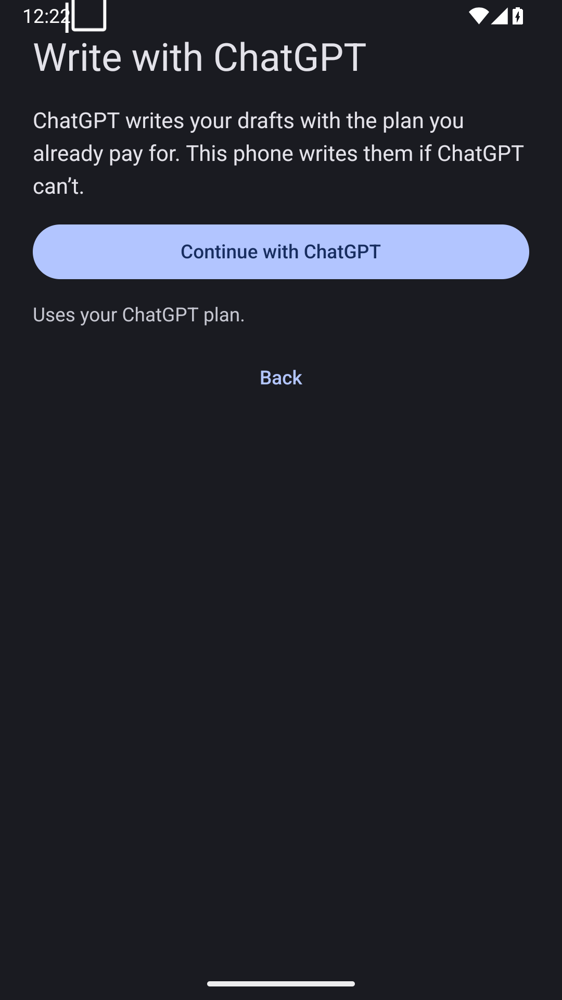
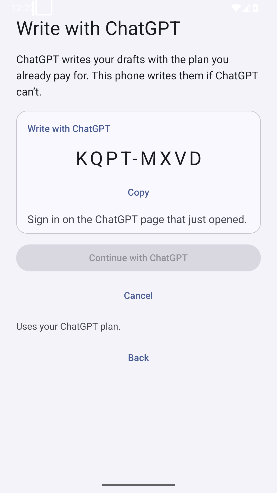
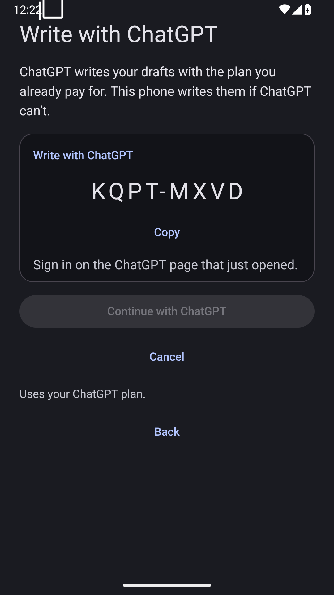
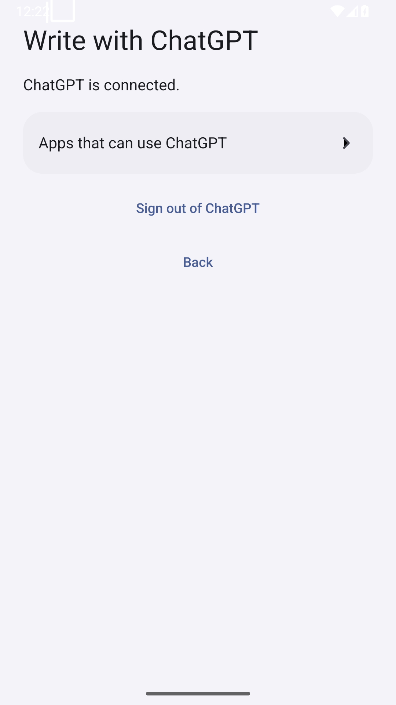
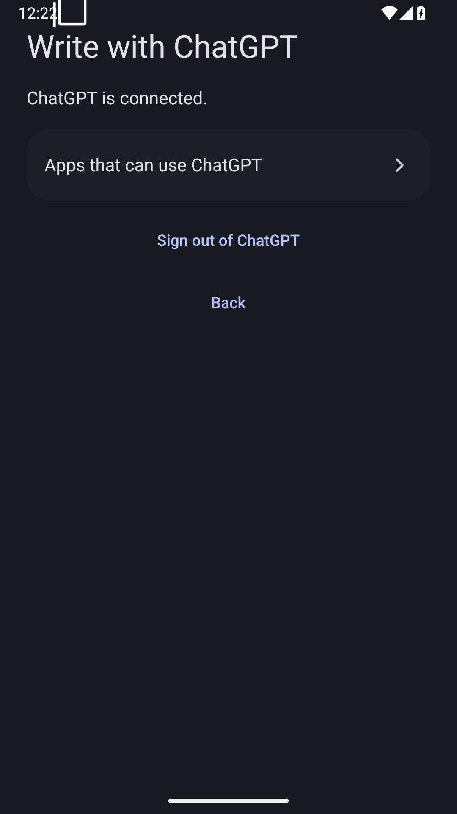
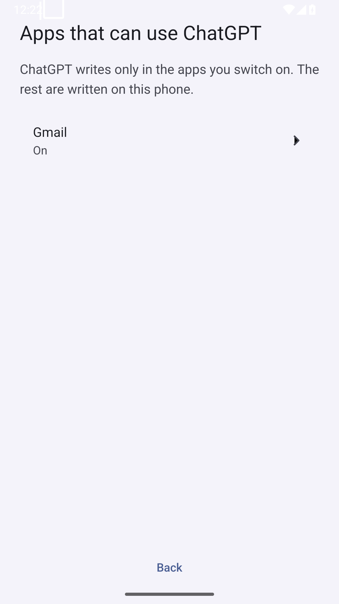
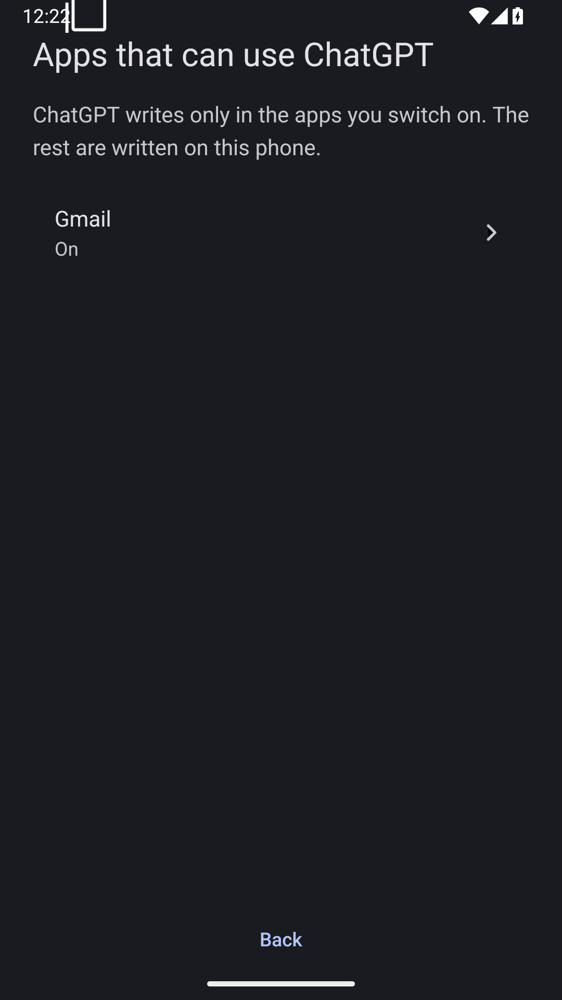

# ChatGPT screens — emulator proof

Release APK built with `EXPO_PUBLIC_E2E_GPT=1 EXPO_PUBLIC_E2E_STUB=1`, installed on this lane's Android 35 x86_64 AVD (`emulator-5580`, no real account). The mock code and drafts never contact ChatGPT. The release bundle built successfully; `npm run lint`, `npm run typecheck`, and `npm test -- --ci --silent` passed (239 tests).

| Screen | Light | Dark |
| --- | --- | --- |
| Before sign-in |  |  |
| Waiting with code |  |  |
| Connected |  |  |
| Per-app choices |  |  |

The same eight files were copied to `/home/umer/.muxr/attachments/pane/w21Q:p2/`. OCR confirmed the code, Copy, waiting, connected and per-app labels; PNG headers confirm 1080×1920. The background sample at (0,1000) changed from `srgba(244,243,250,1)` to `srgba(26,27,33,1)` after `cmd uimode night yes` and force-stop/relaunch. These checks do not assert visual quality.
