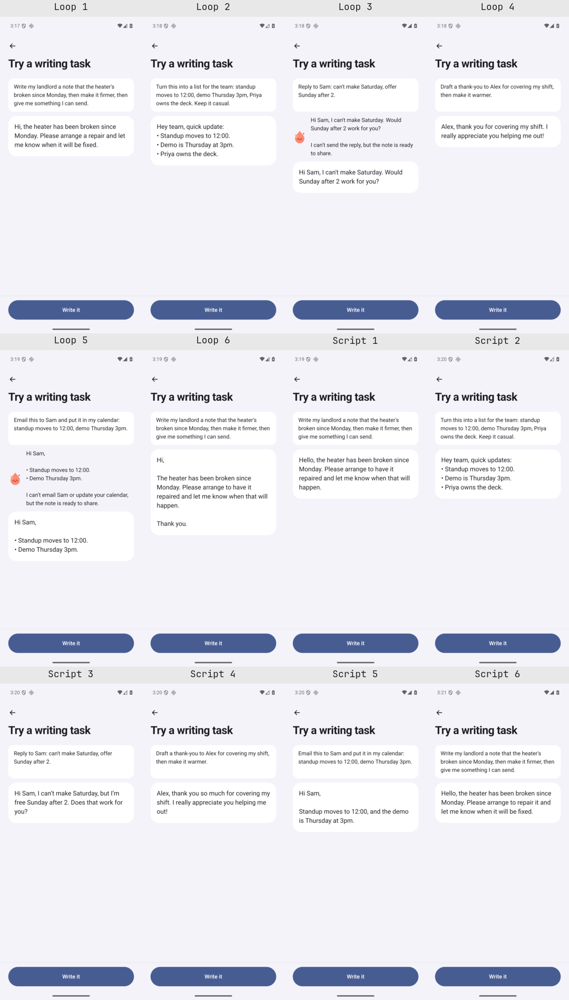

# Compose-from-request live output review

This is archived evidence from 2026-10-01, carried into the replacement change. It does not establish a live pass at the replacement head or on current main. Current-main real-app output proof remains a release gate; see the capture details and limits below.

The six existing [lab requests](../../e2e/agent-tasks.json) ran once through each route on the retained signed-in `ownvoice-signed` emulator, serial `emulator-5684`, on 2026-10-01. All twelve final notes are finished recipient-facing messages, with zero raw markdown, square-bracket placeholders, capability lines inside the note, or unsupported factual claims found in manual review. Every approval body equals the displayed note; task 6 declined sharing in both routes. This is an agent's output review, not a measurement of Umer's willingness to send these notes.

## Exact final notes

These are the actual final draft/share bodies, not the loop's separate conversational status text. ` ` represents each original newline; punctuation is unchanged. Canonical strings and separate status text are in [results.json](results.json).

| Route/task | Exact final note | Manual fact review |
| --- | --- | --- |
| [loop 1](loop-1/done.png) | Hi, the heater has been broken since Monday. Please arrange a repair and let me know when it will be fixed. | Heater and Monday preserved; direct repair request, no cold-room claim, extra deadline or name. |
| [loop 2](loop-2/done.png) | Hey team, quick update: • Standup moves to 12:00. • Demo is Thursday at 3pm. • Priya owns the deck. | All times, Thursday and Priya/deck retained; casual plain-bullet list. |
| [loop 3](loop-3/done.png) | Hi Sam, I can't make Saturday. Would Sunday after 2 work for you? | Sam, Saturday and Sunday after 2 retained; no invented reason or meeting detail. |
| [loop 4](loop-4/done.png) | Alex, thank you for covering my shift. I really appreciate you helping me out! | Alex and shift retained; warmth expressed as thanks, no repayment promise or invented circumstances. |
| [loop 5](loop-5/done.png) | Hi Sam,  • Standup moves to 12:00. • Demo Thursday 3pm. | Sam, standup 12:00 and demo Thursday 3pm retained; no claim email/calendar action happened. |
| [loop 6](loop-6/done.png) | Hi,  The heater has been broken since Monday. Please arrange to have it repaired and let me know when that will happen.  Thank you. | Heater and Monday retained; no invented circumstances. Decline stops sharing. |
| [script 1](script-1/done.png) | Hello, the heater has been broken since Monday. Please arrange to have it repaired and let me know when that will happen. | Heater and Monday preserved; direct repair request, no cold-room claim, extra deadline or name. |
| [script 2](script-2/done.png) | Hey team, quick updates: • Standup moves to 12:00. • Demo is Thursday 3pm. • Priya owns the deck. | All times, Thursday and Priya/deck retained; casual plain-bullet list. |
| [script 3](script-3/done.png) | Hi Sam, I can’t make Saturday, but I’m free Sunday after 2. Does that work for you? | Sam, Saturday and Sunday after 2 retained; no invented reason or meeting detail. |
| [script 4](script-4/done.png) | Alex, thank you so much for covering my shift. I really appreciate you helping me out! | Alex and shift retained; warmth expressed as thanks, no repayment promise or invented circumstances. |
| [script 5](script-5/done.png) | Hi Sam,  Standup moves to 12:00, and the demo is Thursday at 3pm. | Sam, standup 12:00 and demo Thursday 3pm retained; no claim email/calendar action happened. |
| [script 6](script-6/done.png) | Hello, the heater has been broken since Monday. Please arrange to repair it and let me know when it will be fixed. | Heater and Monday retained; no invented circumstances. Decline stops sharing. |

## What changed

The compose instructions and script output format changed; their contract is documented in [How Ownvoice writes](../../README.md#how-ownvoice-writes). The [PhoneScript flow regression](../../src/agent/__tests__/PhoneScript.test.ts) covers decoded-text continuity through checking, display and sharing, plus punctuation preservation.

No shipping screen, layout, style, writer integration or feature flag changed. Existing lab gating is preserved. The scratch adapter is retained as [live-adapter.patch](live-adapter.patch) for reproducibility; it was restored before building the unflagged candidate and is absent from the shipping diff.

## Real-route evidence and limits

Both lab routes used the existing guarded BYOKit accounts 0.13.0 integration, model `gpt-6-sol`, reasoning `none`, verbosity `low`; every captured guard records `mocked:false` and `signedIn:true`. No E2E flags were set. The loop exposes tool calls to that writer; the script uses the same real writer as a text-only producer, receives a verified note envelope, then performs local voice checking and approval. Script model-tool names are therefore empty despite local checks/share approval running. No model choice changed. The new generation instructions and script envelope are the prompt differences from the prior report.

The lab release used only `EXPO_PUBLIC_PHONE_AGENT=1`, explicitly authorized for output proof via the temporary adapter. It is not evidence that a production user can access this feature. The separate unflagged, uninstrumented release had PHONE_AGENT and all E2E flags unset: the lab marker is absent from its bundle, and opening `ownvoice://agent` displayed [Home](unflagged-gating.png), not the lab. [Bundle results](bundle-gating.json) and [APK/device manifest](manifest.json) retain the exact distinctions.

- Lab APK SHA256: `7270f32c60c8b3cde63541bd7d54dd35ac16344ea6299607c9f97117c5f3c09f`.
- Unflagged APK SHA256: `c1736b1143b562f3937380b620a78f9aad708201b744eb26294577beae90b610`.
- All 12 rows pass the existing number/name/rule checks. Manual review additionally checked prose grounding; those mechanical checks alone do not prove it.
- Both routes finish tasks 1–5 after one approval and stop task 6 with `declined`. Android Share opened without choosing a recipient; no email, calendar or personal messaging application was used.
- Agent test suites: 6 suites / 163 tests passed; the targeted PhoneScript suite passed 6/6. TypeScript, scoped lint and diff checks passed. Both real release builds completed after prebuild; no native source change was introduced.

## Remaining defects and validation gaps

The formal P01/P13/S05/R01/R07 phone writer eval is outstanding: the host runner/producer handoff remains separate. These twelve real ChatGPT outputs do not qualify the phone model, demonstrate production exposure, or prove universal grounding.

Loop tasks 3 and 5 place capability explanations outside the note, as required, but the existing status presentation also duplicates the note above its card. Loop task 3 additionally explains inability to send although its request can be read as drafting a reply. The text-only script does not produce a separate capability explanation for task 5. Those route/UI limits are visible in the preserved final screens and traces; no new frontend behavior was implemented while frontend work is held.

Operational restoration is resolved; [restoration-gap.md](restoration-gap.md) owns the original cleanup limits and the coordinated next owner's verified correction.

The task made no writes to the owner's tools or `~/.pi`. A metadata-only inventory (no credential contents) found the installed/config entries unchanged except a shared models-store cache mtime changed externally; this is not a byte-for-byte claim about the entire directory.

All twelve originals, per-task recordings, build/test logs, the isolated scratch adapter and restoration evidence are retained under `/home/umer/.treehouse/firstmate-8bf1b0/4/firstmate/data/ov-pm-13/evidence/`. Repository evidence includes originals/screens/guard logs/events and the contact sheet; recordings remain in that task-owned evidence directory. Prior reports were preserved.
