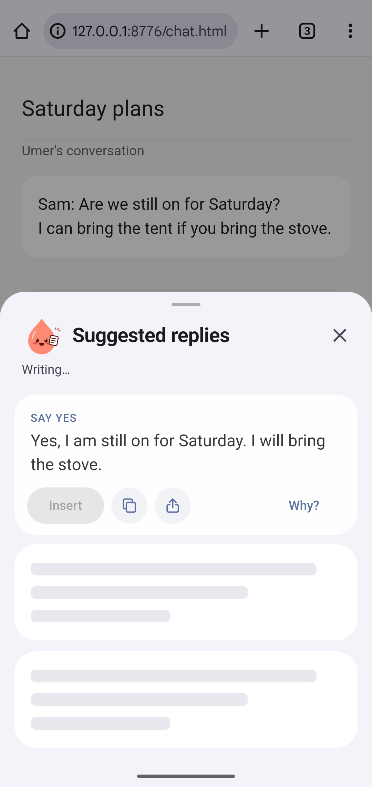

# First reply card from the partial phone stream

2026-09-30. Candidate: `fm/ov-first-card-stream`, based on `30475ea`.

Completed labelled slots now pass through the existing reply checks individually.
For slot boundaries and cleanup rules, see the `take` implementation in
[`phoneWriter.ts`](../src/panel/phoneWriter.ts) and its
[stream regression checks](../src/panel/__tests__/phoneWriter.test.ts).
No prompts, models, retries, ChatGPT paths, or user-facing strings changed.

The existing plain-label stream test already passed before this change. New bold
label tests failed before the fix and passed after it. The phone timing report
contains no raw answer, so bold labels are a reproduced parsing failure, not a
claim about the exact formatting used by AICore in that recorded phone run.

## Validation

- Jest: 47 suites, 770 tests, 46 snapshots passed.
- TypeScript and ESLint passed; `git diff --check` passed.
- Unflagged x86_64 release: `assembleRelease -PreactNativeArchitectures=x86_64
  --no-daemon --console=plain --max-workers=2` passed.
- APK SHA-256: `ce4e49233e50f75e8e6f66af2bbce880ed10a1f598f00ab5ecbe31f929e4b491`;
  installed APK hash matched.

## Three real bubble taps on the local phone writer

Lane-owned AVD `ov-first-card-stream`, Android 36 x86_64, serial `emulator-5642`,
8 GB RAM. AICore absent; logs confirm `model status available (local)`.
The pinned CPU writer file was downloaded into the lane scratch directory,
SHA-256 verified, then placed in the emulator app's files directory. The real
phone writer ran through Native.draftStream and onModelPartial; no writer stub,
mocked partial events, prompt changes, or model changes. “On this phone” was
selected in the app. The captain's phone and existing emulators were untouched.

| Tap | First token ms | First card ms (JS) | Numbered call complete ms (native) |
| --- | ---: | ---: | ---: |
| 1 | 9,954 | 13,778 | 18,565 |
| 2 | 3,555 | 7,212 | 12,064 |
| 3 | 5,433 | 11,436 | 18,006 |

First card precedes numbered-call completion by 4.8–6.6 seconds on all three
runs. These are emulator CPU measurements, not OnePlus latency claims or a
promise of a four-second first card. Log files:
[first](first-card-stream/r1-log.txt), [second](first-card-stream/r2-log.txt),
[third](first-card-stream/r3-log.txt).

A monitor captured the panel immediately after the JS first-card log. The
selected capture shows one completed card, “Writing…” and two unfinished slots;
the underlying chat is demo data for Umer. Status bars were cropped away.

Build, downloaded file, AVD and raw captures are under
`/home/umer/lab-tmp/ov-first-card-stream`, with TMPDIR set there. After proof,
the lane HTTP server and emulator were stopped and the reverse tunnel removed.
The selected image is ready for firstmate to share after merge.
